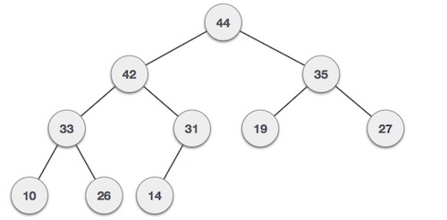
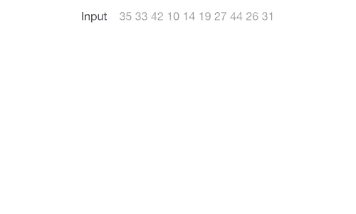
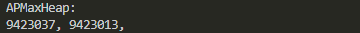

<center>
<h1>
In The Name Of ALLAH
</h1>
<h2>
Advanced Programming - Homework 6
</h2>
<h2>
Dr.Amir Jahanshahi
</h2>
<h3>
Deadline: Friday, 26 Azar - 23:59
</center>


# Introduction
In this homework we would have a simple exercise of **STL** in C++ and **Class Template**.

# STL
After seeing how STL can make our lives easy, we've decided to do some usual tasks of our university by STL. So we need **Student** class with the following description.

```c++
class Student{
    public:
        long id{};
        double avg{};
        size_t units{50};
        Student (long _id, double _avg, size_t _units);
};
```

Based on the application, we would need to use vector, deque or list as our container. So, ```convert``` function would convert containers for us. In other words, this function creates a new container with our desired type from an existing container. You can see gtests for its usage.

You must implement the following functions too:

*  ```show```

    This function can accept any of the mentioned containers as argument and shows them like the following.

```c++
Student s1 {9423013, 18.2, 26};
Student s2 {9423037, 19.2, 30};
Student s3 {9423091, 19.1, 10};
std::deque<Student> d {s1, s2, s3};
std::vector<Student> v {convert<std::vector<Student>>(d)};
std::list<Student> l {convert<std::list<Student>>(d)};
show(d);
show(v);
show(l);
```

The output should be 


*  ```findRank```

    This function gets a container and a number *n* and returns the n'th student based on averages. You can see it's behavior in gtests.

*  ```getRanks```

    This function gets a container and sort its students based on their averages and returns the container. So the first student of this sorted container would be the one with highest average.

*  ```getInterns```

    In orther to qualify students for the internship, we need to sort them based on their units in descending orther. We need this function for this purpose. 

## Note
You are not allowed to use **any** loops (for, while, etc.) in this part. Using a loop may cost you some points!


# Class Template
In this part, you'll be implementing a famous data structure called **Max Heap**. It's super easy! It's a binary tree with a simple rule: **Each node is greater than it's left and right child**. You can see an example below.



Max Heap is an almost complete tree! So each level (depth) must be completed before going deeper. This property makes its implementation easy. You can store it in an array like below.


Doing this, we can find parent, left child and right child easily for each node. In other words, for node **i**, it's parent is the integer part of **i/2** and it's left child is **2*i** and it's right child is **2*i+1**.

So let's begin coding.

# APMaxHeap\<T>
First of all, we'll implement template class **APMaxHeap**. This class has the following private variable.

```c++
std::vector<T*> arr;
```

```arr``` will be used to store elements in the max heap. It's actually the linear array shown above. But it's a little bit different! Instead of storing objects, it stores raw pointers pointing to those objects.

# Insertion
Time to add to our max heap. To add an element to our max heap, first, we add it to the next available place (End of array). Then to keep the property of the heap, we check if the new node is smaller than it's parent. If not, we swap it with it's parent. We keep doing this, until everything is fine. You can see an example below.



So implement ```push``` function for insertion in the heap. You can see how this function must be used in the following block and in gtests.

```c++
APMaxHeap<int> ap;
ap.push(20);
ap.push(5);
ap.push(12);
ap.push(10).push(15).push(28);
```

# Deletion
We want to be able to delete from our heap. In max heaps, we can only delete the root element! So we delete the root first, and then take the last element in the root position. Now we check if the new root is larger than it's children. If not, we swap it with it's larger child. We keep doing this until everything is fine again. You can see an example below.


Implement ```pop``` function for this. Here's how your function must work.

```c++
APMaxHeap<int> ap;
ap.push(10).push(20).push(5).push(12).push(8);
ap.pop();
ap.pop().pop();
```

# Show
It would be nice to see what we have in our max heap. So, implement ```show``` function.
This function also returns a vector of the **elements** (not pointers) stored in max heap in the same order as ```arr```.

You can see the following code and it's result below.

```c++
APMaxHeap<int> ap;
ap.push(10).push(20).push(5).push(12).push(8);
ap.show();
```


# What Else?
Now we suggest you to have a look at the gtests if you haven't so far. In order to pass some tests, you must implement move constructor and some other operators too. **Don't forget to *cout* each constructor or operator's name when it is called**.

# Student
We've decided to store AP students in our max heap. Each student has an **id** and an **average**. We want to put students based on their averages in max heap. 

Your class must have the following member functions and member variables. You can define more if you'd like, but you're not allowed to change the following prototypes at all.

```c++
class Student{
    private:
        long id;
        double average;
    public:
        Student(long id, double avg);
        long getID();
        double getAverage();
};
```

The following code adds 0.2 to a student's grade.

```c++
Student s{9423013, 18.1};
s+=0.2;
```


# Final Step
If you run the following code and get the desired result, congratulations.

```c++
Student s1{9423013, 18.1};
Student s2{9423037, 19};
APMaxHeap<Student> aps;
aps.push(s1).push(s2);
aps.show();
```




# main File
You must not alter the **main.cpp** file at all. Good luck!

